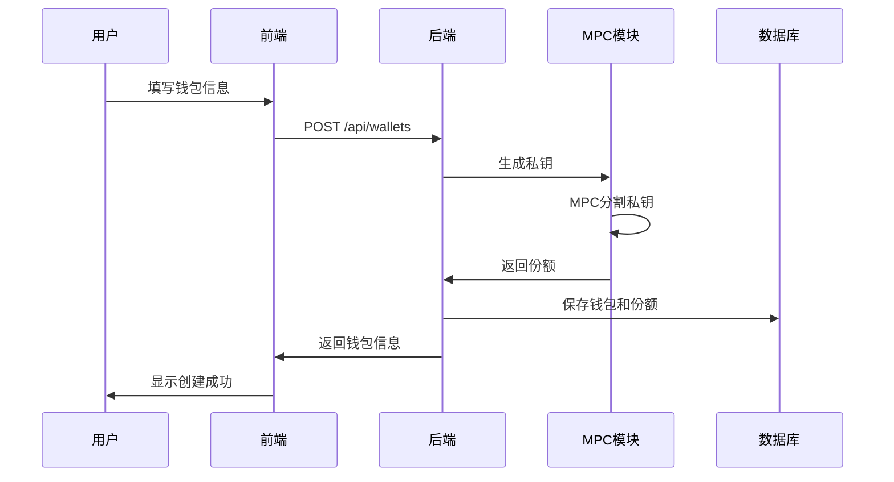
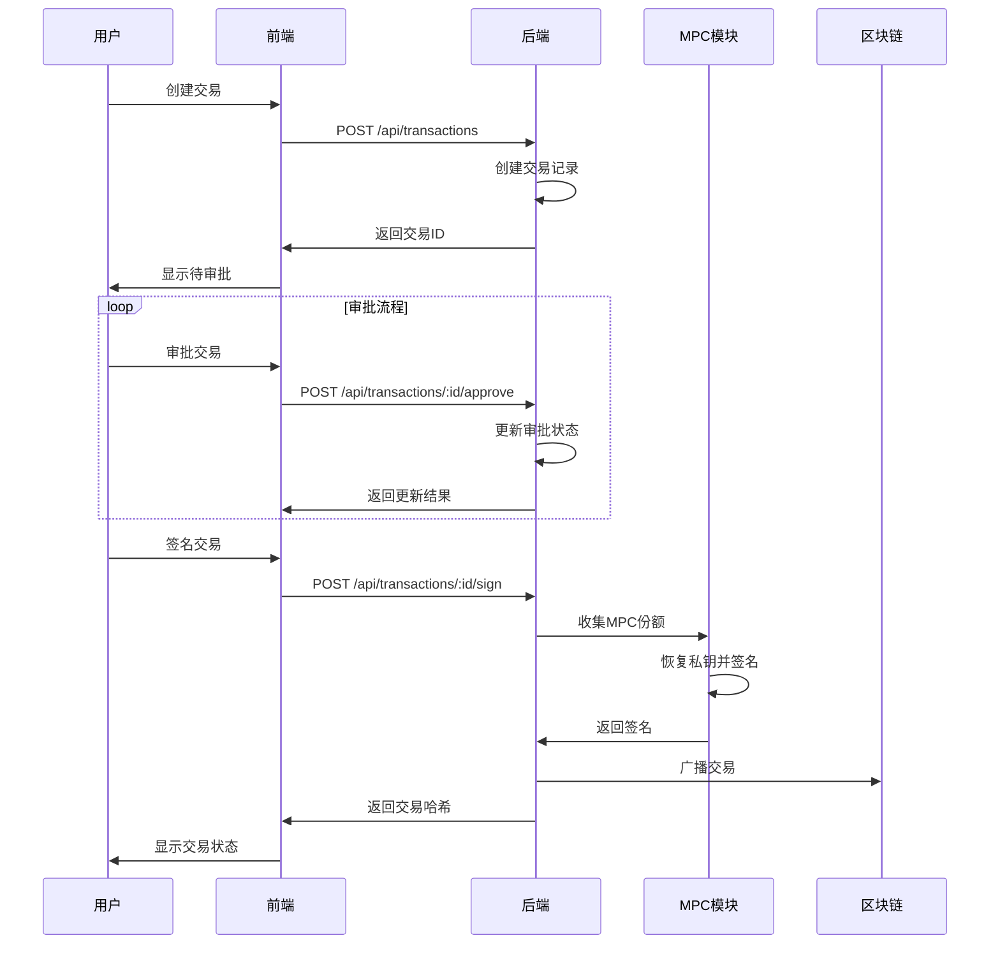
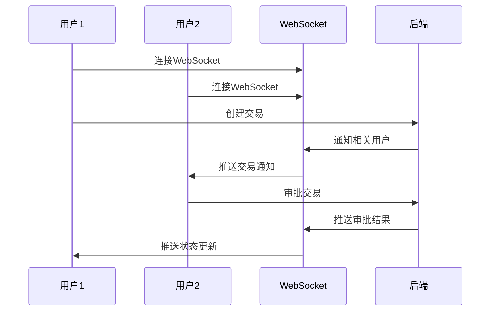

# MPC钱包系统设计文档

## 1. 系统概述

### 1.1 项目目标
设计并实现一个基于多方计算（MPC）技术的加密货币钱包系统，提供安全的数字资产管理解决方案。

### 1.2 核心特性
- **分布式密钥管理**：使用MPC技术分割私钥，无单点故障
- **多签名交易**：支持t-of-n签名机制
- **实时协作**：WebSocket实时通信
- **审计日志**：完整的操作记录
- **多链支持**：支持BTC、ETH、BSC等主流区块链

## 2. 系统架构

### 2.1 整体架构图
```
┌─────────────────┐    ┌─────────────────┐    ┌─────────────────┐
│   前端应用      │    │   后端API       │    │   区块链网络     │
│   (React)       │◄──►│   (Node.js)     │◄──►│   (BTC/ETH)     │
└─────────────────┘    └─────────────────┘    └─────────────────┘
         │                       │
         │              ┌─────────────────┐
         └──────────────►│   WebSocket     │
                        │   (实时通信)     │
                        └─────────────────┘
```

### 2.2 技术栈
- **前端**：React + TypeScript + Ant Design
- **后端**：Node.js + Express + Socket.io
- **MPC算法**：Shamir秘密共享
- **数据库**：PostgreSQL + Redis
- **安全**：TLS 1.3 + AES-256-GCM

## 3. 核心功能模块

### 3.1 钱包管理模块
**功能描述**：创建、管理MPC钱包，处理密钥分割和份额分发

**关键流程**：
1. **钱包创建**
   ```
   用户输入 → 验证参数 → 生成私钥 → MPC分割 → 分发份额 → 创建钱包
   ```

2. **份额管理**
   ```
   份额生成 → 加密存储 → 安全分发 → 份额验证 → 备份恢复
   ```

**数据模型**：
```typescript
interface Wallet {
  id: string;
  name: string;
  address: string;
  chain: Blockchain;
  threshold: number;
  totalShares: number;
  participants: string[];
  status: WalletStatus;
  balance: AssetBalance[];
  createdAt: Date;
  updatedAt: Date;
}
```

### 3.2 交易管理模块
**功能描述**：处理加密货币交易，包括创建、审批、签名和广播

**关键流程**：
1. **交易创建**
   ```
   用户输入 → 验证余额 → 创建交易 → 等待审批 → 审批通过 → MPC签名 → 广播
   ```

2. **审批流程**
   ```
   交易创建 → 通知参与者 → 收集审批 → 检查阈值 → 更新状态
   ```

3. **MPC签名**
   ```
   收集份额 → 恢复私钥 → 生成签名 → 验证签名 → 广播交易
   ```

**数据模型**：
```typescript
interface Transaction {
  id: string;
  walletId: string;
  txHash: string;
  from: string;
  to: string;
  amount: string;
  symbol: string;
  status: TransactionStatus;
  type: TransactionType;
  signatures: Signature[];
  approvals: Approval[];
  createdAt: Date;
  updatedAt: Date;
}
```

### 3.3 用户管理模块
**功能描述**：管理用户账户、权限和角色

**角色定义**：
- **管理员**：系统管理，用户管理
- **操作员**：创建交易，管理钱包
- **审批员**：审批交易
- **查看者**：只读权限

**权限矩阵**：
| 功能 | 管理员 | 操作员 | 审批员 | 查看者 |
|------|--------|--------|--------|--------|
| 创建钱包 | ✓ | ✓ | ✗ | ✗ |
| 创建交易 | ✓ | ✓ | ✗ | ✗ |
| 审批交易 | ✓ | ✗ | ✓ | ✗ |
| 签名交易 | ✓ | ✓ | ✓ | ✗ |
| 查看数据 | ✓ | ✓ | ✓ | ✓ |

## 4. 交互流程

### 4.1 钱包创建流程


### 4.2 交易处理流程


### 4.3 实时通信流程


## 5. 页面设计

### 5.1 仪表板页面
**功能**：系统概览，关键指标展示

**数据信息**：
- 总钱包数
- 总资产价值
- 待处理交易数
- 活跃用户数
- 最近交易列表
- 钱包概览表格
- MPC份额状态
- 系统状态

**交互元素**：
- 统计卡片
- 数据表格
- 进度条
- 状态标签

### 5.2 钱包管理页面
**功能**：钱包的创建、查看、管理

**数据信息**：
- 钱包列表
- 钱包详情
- MPC份额分布
- 安全配置
- 资产余额

**交互元素**：
- 创建钱包按钮
- 钱包表格
- 详情抽屉
- 设置模态框

### 5.3 交易管理页面
**功能**：交易的创建、审批、签名

**数据信息**：
- 交易列表
- 交易详情
- 审批记录
- 签名记录
- 交易状态

**交互元素**：
- 创建交易按钮
- 交易表格
- 审批模态框
- 详情抽屉
- 状态步骤条

## 6. 安全设计

### 6.1 密钥安全
- **私钥分割**：使用Shamir秘密共享算法
- **份额加密**：AES-256-GCM加密存储
- **安全分发**：TLS 1.3加密传输
- **份额轮换**：定期更新份额

### 6.2 通信安全
- **HTTPS**：所有API通信使用HTTPS
- **WebSocket安全**：WSS加密连接
- **JWT认证**：基于JWT的身份验证
- **权限控制**：基于角色的访问控制

### 6.3 审计安全
- **操作日志**：记录所有关键操作
- **审计追踪**：完整的操作历史
- **异常检测**：监控异常行为
- **合规报告**：生成合规性报告

## 7. 性能优化

### 7.1 前端优化
- **代码分割**：按路由分割代码
- **懒加载**：组件和图片懒加载
- **缓存策略**：合理的缓存配置
- **虚拟滚动**：大数据列表优化

### 7.2 后端优化
- **数据库索引**：优化查询性能
- **Redis缓存**：缓存热点数据
- **连接池**：数据库连接池
- **负载均衡**：多实例部署

### 7.3 MPC优化
- **并行计算**：并行处理份额计算
- **批量操作**：批量处理交易
- **缓存机制**：缓存计算结果
- **异步处理**：异步处理耗时操作

## 8. 部署架构

### 8.1 开发环境
```
┌─────────────────┐    ┌─────────────────┐
│  前端 (3000)    │    │  后端 (3001)    │
│   React Dev     │◄──►│   Node.js Dev   │
└─────────────────┘    └─────────────────┘
```

### 8.2 生产环境
```
┌─────────────────┐    ┌─────────────────┐    ┌─────────────────┐
│  负载均衡器     │    │  应用服务器     │    │  数据库服务器   │
│   Nginx         │◄──►│   Node.js       │◄──►│   PostgreSQL    │
└─────────────────┘    └─────────────────┘    └─────────────────┘
         │                       │                       │
         │              ┌─────────────────┐    ┌─────────────────┐
         └──────────────►│   Redis缓存     │    │   文件存储      │
                        └─────────────────┘    └─────────────────┘
```

## 9. 监控和告警

### 9.1 系统监控
- **性能监控**：CPU、内存、磁盘使用率
- **网络监控**：网络延迟、带宽使用
- **应用监控**：API响应时间、错误率
- **安全监控**：异常登录、权限变更

### 9.2 业务监控
- **交易监控**：交易成功率、处理时间
- **钱包监控**：钱包创建、份额状态
- **用户监控**：活跃用户、操作频率
- **安全监控**：MPC协议状态、份额完整性

### 9.3 告警机制
- **实时告警**：关键错误立即通知
- **阈值告警**：性能指标超过阈值
- **趋势告警**：异常趋势预警
- **安全告警**：安全事件通知

## 10. 扩展性设计

### 10.1 水平扩展
- **无状态设计**：应用层无状态
- **数据库分片**：按用户或钱包分片
- **缓存集群**：Redis集群部署
- **负载均衡**：多实例负载均衡

### 10.2 功能扩展
- **插件系统**：支持功能插件
- **API版本**：API版本管理
- **配置管理**：动态配置更新
- **多租户**：支持多租户部署

这个系统设计提供了完整的MPC钱包解决方案，涵盖了从用户界面到后端处理的所有关键组件，确保系统的安全性、可用性和可扩展性。 